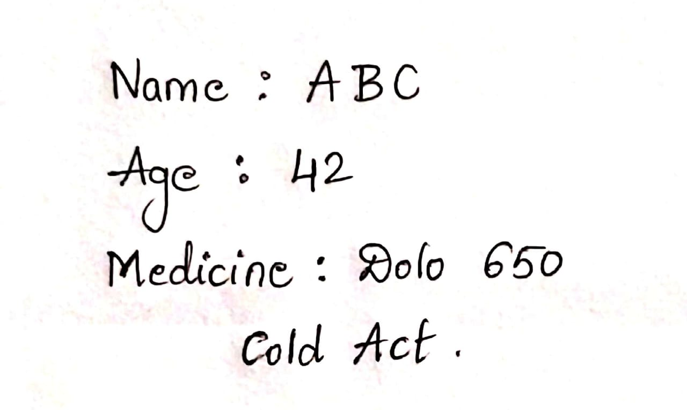
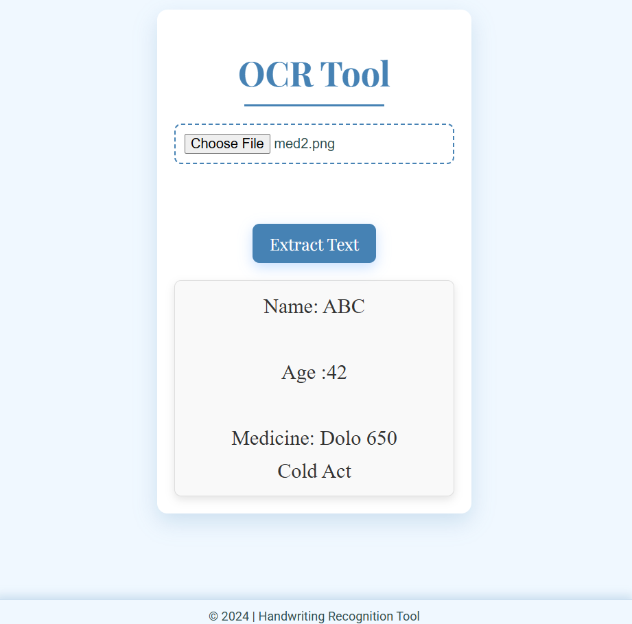

## Handwritten Prescription Recognition

This project is a Flask-based web application that extracts and recognizes text from handwritten medical prescriptions. It provides a simple frontend to upload prescription images and displays the recognized text.

✨ Features

✅ Upload handwritten prescription images✅ OCR (Optical Character Recognition) using Tesseract✅ Preprocessing techniques for better text extraction✅ View extracted text in a structured format✅ Simple and clean web interface

🖼️ Screenshots

Handwritten Prescription Sample:

Web App Interface

🚀 Installation & Setup

1️⃣ Clone the Repository

git clone https://github.com/your-username/prescription-recognition.git
cd prescription-recognition

2️⃣ Create & Activate Virtual Environment

python -m venv venv
venv\Scripts\activate  # Windows
source venv/bin/activate  # macOS/Linux

3️⃣ Install Dependencies

pip install -r requirements.txt

4️⃣ Install Tesseract OCR

Windows: Download here and set the path in app.py.

Linux/macOS:

sudo apt install tesseract-ocr  # Ubuntu/Debian
brew install tesseract          # macOS

5️⃣ Run the Flask App

python app.py

6️⃣ Open in Browser

http://127.0.0.1:5000

🔧 Troubleshooting

ModuleNotFoundError: No module named 'flask'→ Run: pip install flask

No module named 'pytesseract'→ Run: pip install pytesseract

TesseractNotFoundError→ Ensure Tesseract is installed and correctly set in app.py.

📌 Technologies Used

Flask (Backend Framework)

Tesseract OCR (Text Recognition)

OpenCV & PIL (Image Processing)

HTML, CSS, JavaScript (Frontend)

